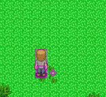
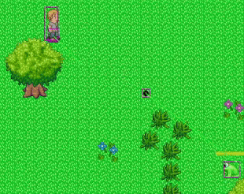
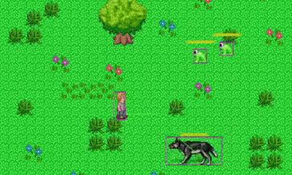
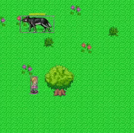

# Bullet_RPG

## Introduction

BulletRPG is a game where you get to play as a character and shoot various types of enemies in order to obtain coins. The coins can then be spent in shop where you can buy weapons and upgrades to help aid your character for upcoming battles.

## [Link](https://bulletrpg.herokuapp.com/) 

* Frontend
  * Node.js - v.14.17.6
  * Phaser - v.3.55.2
  * Express - v.4.17.2
  * SocketIO - v.4.4.1

## Features

### Movement and Shooting
The User may move the character by using the keys WASD, corresponding to each direction. They may also shoot by clicking the left button on the mouse which shoots a projcetile in that direction




```
if (this.#scene.Player != null && this.#scene.Player.active) {
            if (this.#keyboard.D.isDown) {
                //clientContoller.movePlayer("moveright");
                this.#scene.Player.setVelocityX(128);
                //this.#scene.socketControl.pass(new info(0, this.#scene.Player.x, this.#scene.Player.y, this.#scene.Player.body.velocity.x, this.#scene.Player.body.velocity.y, false));
                //constructor(time, velocityX, velocityY, shoot){
            }
            if (this.#keyboard.A.isDown) {
                this.#scene.Player.setVelocityX(-128);
                // this.#scene.socketControl.pass(new info(0, this.#scene.Player.x, this.#scene.Player.y, this.#scene.Player.body.velocity.x, this.#scene.Player.body.velocity.y, false));
            }
            if (this.#keyboard.W.isDown) {
                this.#scene.Player.setVelocityY(-128);
                // this.#scene.socketControl.pass(new info(0, this.#scene.Player.x, this.#scene.Player.y, this.#scene.Player.body.velocity.x, this.#scene.Player.body.velocity.y, false));
            }
            if (this.#keyboard.S.isDown) {
                this.#scene.Player.setVelocityY(128);
                // this.#scene.socketControl.pass(new info(0, this.#scene.Player.x, this.#scene.Player.y, this.#scene.Player.body.velocity.x, this.#scene.Player.body.velocity.y, false));
            }
            if (this.#keyboard.A.isUp && this.#keyboard.D.isUp) {
                this.#scene.Player.setVelocityX(0);
                // this.#scene.socketControl.pass(new info(0, this.#scene.Player.x, this.#scene.Player.y, this.#scene.Player.body.velocity.x, this.#scene.Player.body.velocity.y, false));
            }
            if (this.#keyboard.W.isUp && this.#keyboard.S.isUp) {
                this.#scene.Player.setVelocityY(0);
                // this.#scene.socketControl.pass(new info(0, this.#scene.Player.x, this.#scene.Player.y, this.#scene.Player.body.velocity.x, this.#scene.Player.body.velocity.y, false));
            }
            if (this.#keyboard.A.isDown && this.#keyboard.W.isDown) {
                this.#scene.Player.setVelocityY(-90);
                this.#scene.Player.setVelocityX(-90);
                // this.#scene.socketControl.pass(new info(0, this.#scene.Player.x, this.#scene.Player.y, this.#scene.Player.body.velocity.x, this.#scene.Player.body.velocity.y, false));
            }
            if (this.#keyboard.W.isDown && this.#keyboard.D.isDown) {
                this.#scene.Player.setVelocityY(-90);
                this.#scene.Player.setVelocityX(90);
                // this.#scene.socketControl.pass(new info(0, this.#scene.Player.x, this.#scene.Player.y, this.#scene.Player.body.velocity.x, this.#scene.Player.body.velocity.y, false));
            }
            if (this.#keyboard.D.isDown && this.#keyboard.S.isDown) {
                this.#scene.Player.setVelocityY(90);
                this.#scene.Player.setVelocityX(90);
                // this.#scene.socketControl.pass(new info(0, this.#scene.Player.x, this.#scene.Player.y, this.#scene.Player.body.velocity.x, this.#scene.Player.body.velocity.y, false));
            }
            if (this.#keyboard.A.isDown && this.#keyboard.S.isDown) {
                this.#scene.Player.setVelocityY(90);
                this.#scene.Player.setVelocityX(-90);
                // this.#scene.socketControl.pass(new info(0, this.#scene.Player.x, this.#scene.Player.y, this.#scene.Player.body.velocity.x, this.#scene.Player.body.velocity.y, false));
            }
        }
        if(this.#scene.Player != null && this.#scene.Player.gunController != null) {
            if (this.#keyboard.Q.isDown) {
                if (this.#scene.Player.switchGunCoolDown <= 0) {
                    this.#scene.Player.gunController.nextGun();
                    this.#scene.Player.switchGunCoolDown = 2000;
                }
                else {
                    console.log(this.#scene.Player.switchGunCoolDown + " ms until gun can be swapped");
                }
                this.#keyboard.Q.isDown = false;
            }   
        }
```
```
    shoot() {
        let startX = this.Player.x + this.Player.width / 4;
        let startY = this.Player.y + this.Player.height / 4;
        let targetX = this.cursor.x / this.camera.zoom;
        let targetY = this.cursor.y / this.camera.zoom;
        let bullet = this.getBulletArray().get(startX, startY, this.#bulletImage).setScale(1.5);
        bullet.damage = this.#bulletDamage;
        bullet.visible = true;
        bullet.active = true;
        bullet.setVelocity(startX, startY, targetX, targetY, this.camera, this.#bulletSpeed);
        bullet.spawnX = this.Player.x;
        bullet.spawnY = this.Player.y;
        this.#coolDown = this.#fireRate;
    }
```

### Monster AI
The monsters in the game may move in unpredictable ways, they may have various abilities that the player is unaware of, which may catch the player off-guard. Make sure to be prepared at all times.



```
export default class Lunge extends State {
    onEnter() {
        this.lungetime = 1500;
        let Player = this.getStateMachine().Player;
        let enemy = this.getStateMachine().sprite;

        let velocityX = Player.x - enemy.body.x;
        let velocityY = Player.y - enemy.body.y;

        let distance = Math.sqrt(velocityX * velocityX + velocityY * velocityY);
        velocityX = velocityX / distance * 200;
        velocityY = velocityY / distance * 200;

        enemy.setVelocityX(velocityX);
        enemy.setVelocityY(velocityY);
    }


    onExit() {

    }


    update(deltaT) {
        this.lungetime -= deltaT
        if (this.lungetime <= 0) {
            this.getStateMachine().changeState("follow")
        }
    }
}
```

### Different Guns


The player can switch between two types of guns with the Q button, one has more damage and range, but has less fire rate. Make sure that every shot counts. The other gun has more fire rate, less range and less damage, making it a better gun for close combat.

```
    setCustom(gunName, bulletSpeed, bulletRange, bulletDamage, fireRate, bulletImage) {
        this.#gunName = gunName;
        this.#bulletSpeed = bulletSpeed;
        this.#bulletRange = bulletRange;
        this.#bulletDamage = bulletDamage;
        this.#fireRate = fireRate;
        this.#bulletImage = bulletImage;
        this.#coolDown = this.#fireRate;
    }
```

```
export default class Pistol extends Gun{
    constructor(gunName, gunManager, scene){
        super(gunName, gunManager, scene);
        this.setCustom("Pistol", "500", "250", "150", "300", "projectiles");
    }
}
export default class Sniper extends Gun{
    constructor(gunName, gunManager, scene){
        super(gunName, gunManager, scene);
        this.setCustom("Sniper", "1000", "500", "300", "750", "projectiles");
    }
}
```

### Collidables



Objects can often be found around the mapp. This includes trees and houses. This can used to your advantage by hiding behind objects such tha a monster may not be able to reach you. However, this may also become a nuisance if you want to get away from a monster and end up colliding with an object.

```
    if(scene.terrain != null)
        this.collidablesTerrain(scene, scene.terrain.getMapColliables());
    else {
        this.collidablesTerrain(scene, [scene.colliables]);
    }
    collidablesTerrain(scene, collidables) {
        for (var i = 0; i < collidables.length; i++) {
            scene.physics.add.collider(this, collidables[i]);
            collidables[i].setCollisionByProperty({ collides: true });
        }
    }
```